# Retro Game Console Icons

## 1. Game console icons
   - 160w 
   - 256w
   - 512w

| Device Name |  Icon Name  | Icon                                               |
|:-----------:|:-----------:|----------------------------------------------------|
|   ArduBoy   |   arduboy   | 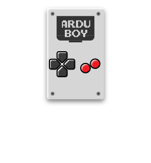     |   
|     32x     |     32x     |          |   
| Atari 5200  |    5200     | 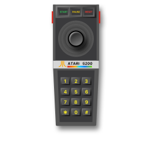        |    
| Atari 7800  |    7800     | 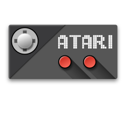        |
|    atari    |    atari    | 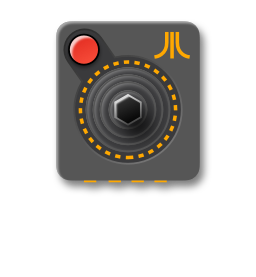       |
|   atarist   |   atarist   | 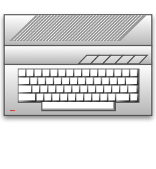     |
|    Amiga    |    amiga    | 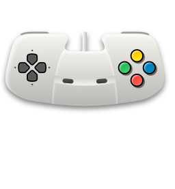       |
|   Arcade    |   arcade    | 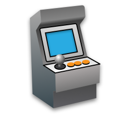      |
|     c64     |     c64     | 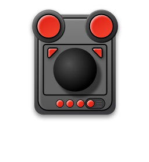         |
|     col     |     col     | 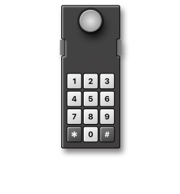         |
|     cpc     |     cpc     | 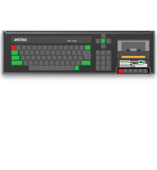         |
|    cps1     |    cps1     |         |
|    cps2     |    cps2     | 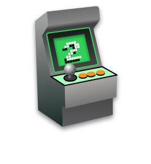        |
|    cps3     |    cps3     | 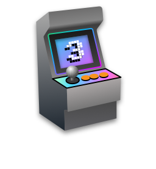        |
|     dc      |     dc      | 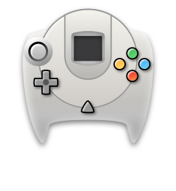          |
|     dos     |     dos     | 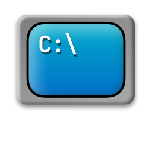         |
|   easyrpg   |   easyrpg   |      |
|  fairchild  |  fairchild  | 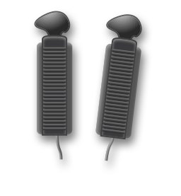   |
|     fc      |     fc      | 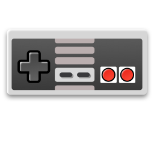          |
|     fds     |     fds     | 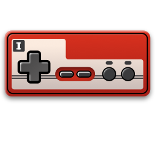         |
|     gb      |     gb      | 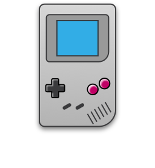          |
|     gba     |     gba     | 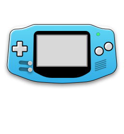         |
|     gbc     |     gbc     | 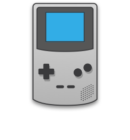         |
|     gg      |     gg      | 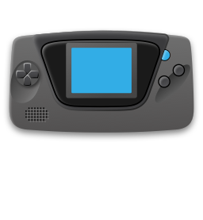          |
|     gw      |     gw      | 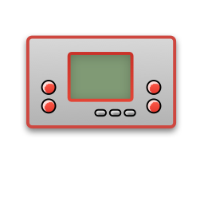          |
|     itv     |     itv     | 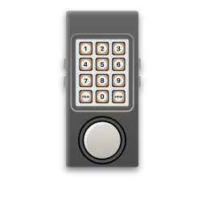         |
|    lynx     |    lynx     | 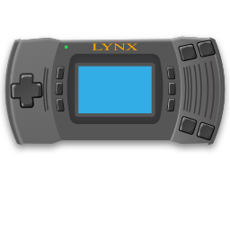        |
|    mame     |    mame     |         |
|     md      |     md      | 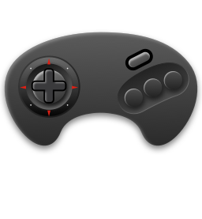          |
|  megaduck   |  megaduck   |     |
|     32X     |     32X     | 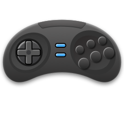         |
|    5200     |    5200     |         |
|    7800     |    7800     |         |
|    amiga    |    amiga    |        |
|   arcade    |   arcade    |       |
|   arduboy   |   arduboy   |      |
|    atari    |    atari    |        |
|   atarist   |   atarist   |      |
|     c64     |     c64     |          |
|     col     |     col     |          |
|     cpc     |     cpc     |          |
|    cps1     |    cps1     |         |
|    cps2     |    cps2     |         |
|    cps3     |    cps3     |         |
|     dc      |     dc      |           |
|     dos     |     dos     |          |
|   easyrpg   |   easyrpg   |      |
|  fairchild  |  fairchild  |    |
|     fc      |     fc      |           |
|     fds     |     fds     |          |
|     gb      |     gb      |           |
|     gba     |     gba     |          |
|     gbc     |     gbc     |          |
|     gg      |     gg      |           |
|     gw      |     gw      |           |
|     itv     |     itv     |          |
|    lynx     |    lynx     |         |
|    mame     |    mame     |         |
|     md      |     md      |           |
|  megaduck   |  megaduck   |     |
|     ms      |     ms      | 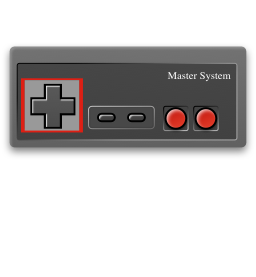          |
|    msu1     |    msu1     | 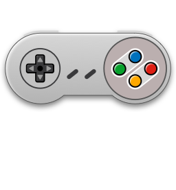        |
|    msumd    |    msumd    |        |
|     msx     |     msx     | 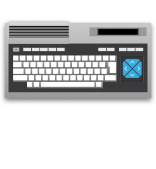         |
|     n64     |     n64     |          |
|     nds     |     nds     | 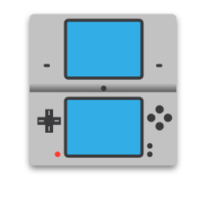         |
|    neocd    |    neocd    |        |
|   neogeo    |   neogeo    | 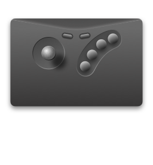      |
|     ngp     |     ngp     | 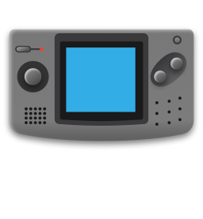         |
|    ngpc     |    ngpc     |         |
|     ody     |     ody     | 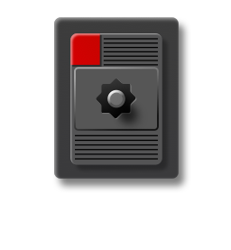         |
|   openbor   |   openbor   |      |
|     pce     |     pce     | 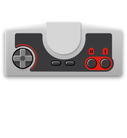         |
|    pcecd    |    pcecd    | 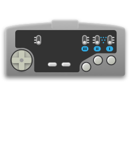       |
|    pico     |    pico     | 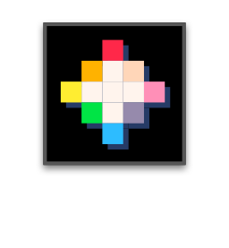        |
|    poke     |    poke     | 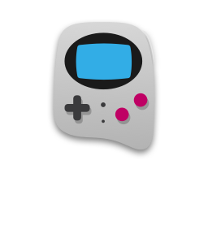        |
|    ports    |    ports    | 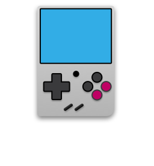       |
|     ps      |     ps      | 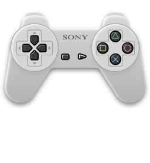          |
|     psp     |     psp     | 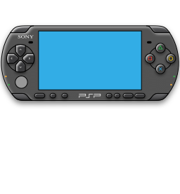         |
|   satella   |   satella   |      |
|   scummvm   |   scummvm   |      |
|   search    |   search    | 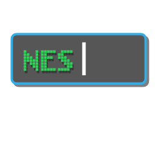      |
|   segacd    |   segacd    |       |
|  segasgone  |  segasgone  | 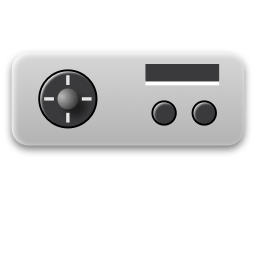   |
|     sfc     |     sfc     | 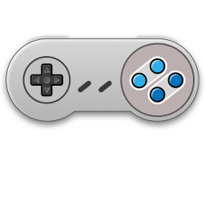         |
|     sgb     |     sgb     | 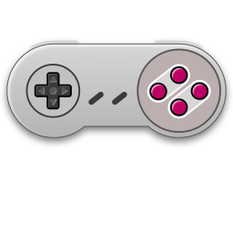         |
|    sgfx     |    sgfx     | 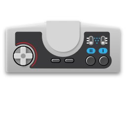        |
|   sufami    |   sufami    | 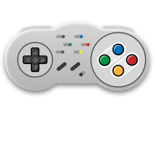      |
| supervision | supervision | 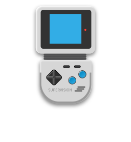 |
|     tic     |     tic     |          |
|     vb      |     vb      |           |
|     vdp     |     vdp     | 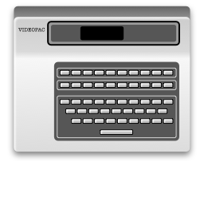         |
|   vectrex   |   vectrex   | 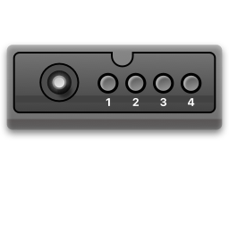     |
|     ws      |     ws      |           |
|     wsc     |     wsc     |          |
|     zxs     |     zxs     | 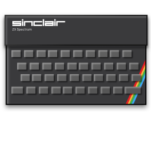         |

## 2. Menu main

|   Name    | Icon Name | Icon Active                                           | Icon Inactive                                         |
|:---------:|:---------:|-------------------------------------------------------|-------------------------------------------------------|
|    app    |    app    |        |        |  
| favorite  | favorite  |   |   |  
|   game    |   game    |       |       |  
|  recent   |  recent   |     |     |  
| retroarch | retroarch |  |  |  
|  setting  |  setting  |    |    |  
