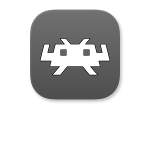

> [→ series_miyoo icons](./series_miyoo/README.md)

# Series TrimUI
# Retro game console icons, etc.
High resolution. Take whatever you need and create something great.

- Retro game console icons
- TrimUI app icons
- Art

They will look better on a black background, as I used a black background when drawing them.

## 1. Game console icons
   - 300w@1x 
   - 600w@2x 

|                                          Icon                                           |                                      Icon                                       |                                     Icon                                     |                                         Icon                                          |                                       Icon                                        |
|:---------------------------------------------------------------------------------------:|:-------------------------------------------------------------------------------:|:----------------------------------------------------------------------------:|:-------------------------------------------------------------------------------------:|:---------------------------------------------------------------------------------:|
|          ADVMAME         |        AMIGA       |    AMIGACD    |       AMIGACDTV      |        ARCADE       | 
|     ARCADE_FBNEO    |      ARDUBOY     |  ATARI2600  |       ATARI5200      |     ATARI7800    | 
|     ATARI800-alt    |     ATARI800    |    ATARIST    |      ATOMISWAVE     |           C64          | 
|       CANNONBALL      |    CAVESTORY   |   CHAILOVE   |        CHANNELF       |        COLECO       | 
|           COLSGM          |          CPC         |       CPET       |          CPLUS4         |          CPS1         | 
|             CPS2            |         CPS3        |     DAPHNE     |              DC             |     DINOTHAWR    | 
|             DOOM            |          DOS         |    EASYRPG    |      ENTERPRISE     |         FBNEO        | 
|               FC              |          FDS         |  FLASHBACK  |              GB             |           GBA          | 
|              GBC             |           GG          |         GW         |   INTELLIVISION  |      LOWRESNX     | 
|            LUTRO           |         LYNX        |       MAME       |    MAME2003PLUS   |      MAME2010     | 
|               MD              |        MDMSU       |   MEGADUCK   |              MS             |           MSX          | 
|             MSX2            |          N64         |      N64DD      |           NAOMI          |           NDS          | 
|            NEOCD           |       NEOGEO      |        NGC        |             NGP            |       OPENBOR      | 
|           PALMOS          |    PANASONIC   |       PC88       |            PC98           |           PCE          | 
|            PCECD           |         PCFX        |        PGM        |            PICO           |      POKEMINI     | 
|            PORTS           |           PS          |        PSP        |        PSPMINIS       |   SATELLAVIEW  | 
|           SATURN          |      SCUMMVM     |    SEGA32X    |          SEGACD         |           SFC          | 
|           SFCMSU          |          SFX         |     SG1000     |             SGB            |        SUFAMI       | 
|  SUPERVISION-alt |  SUPERVISION |    THOMSON    |            TI83           |           TIC          | 
|         TYRQUAKE        |       UZEBOX      |         VB         |         VECTREX        |         VIC20        | 
|     VIDEOPAC-alt    |     VIDEOPAC    |     VIDEOS     |        VIDEOTON       |

## 2. TrimUI app icons

|                                      Icon                                       |                                          Icon                                           |                                            Icon                                             |                                       Icon                                        |                                       Icon                                        |
|:-------------------------------------------------------------------------------:|:---------------------------------------------------------------------------------------:|:-------------------------------------------------------------------------------------------:|:---------------------------------------------------------------------------------:|:---------------------------------------------------------------------------------:|
|     BootLogo    |      EbookReader     |   EmulatorsCleaner  |   FileManager  |   MusicPlayer  | 
|   OTA-update  |       PortMaster      |             Random            |        Reboot       |     RetroArch    | 
|      Scraper     |   ScreenRecorder  |        SystemTools       |      Terminal     |     UserGuide    | 
|    fn_editor   |        moonlight       |             player            |   usb_storage  |
