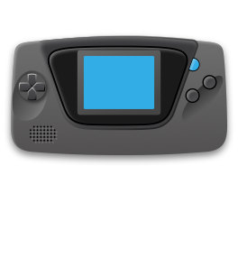

# Retro game console icons, etc.
High resolution. Take whatever you need and create something great.

- Retro game console icons
- Miyoo main menu icons
- Miyoo app icons
- Art

They will look better on a black background, as I used a black background when drawing them.

## 1. Game console icons
   - 132w@1x 
   - 264w@2x 
   - 396w@2x 
   - 528w@2x 
   - 512w
   - 1024w

|          Device Name          | Icon File Name | Icon                                                  |        Device Name        | Icon File Name | Icon                                                |
|:-----------------------------:|:--------------:|-------------------------------------------------------|:-------------------------:|:--------------:|-----------------------------------------------------|
|          IntelliVis           |      itv       |          |            PSP            |      psp       |        |
|             Amiga             |     amiga      |        |       Genesis MSU1        |      msu1      |       |
|         Genesis MSUMD         |     msumd      |        |          Arcade           |     arcade     |     |
|            ArduBoy            |    arduboy     |      |          AtariST          |    atarist     |    |
|            EasyRPG            |    easyrpg     |      |          MS-DOS           |      dos       |        |
|            OpenBor            |    openbor     |      |          PICO-8           |      pico      |       |
|            ScummVM            |    scummvm     |      |                           |                |                                                     |
|            Sega CD            |     segacd     |       |         Sega 32X          |      32X       |        |
|           VideoPac            |      vdp       |          |        Amstrad CPC        |      cpc       |        |
|          Atari 2600           |     atari      |        |        Atari 5200         |      5200      |       |    
|          Atari 7800           |      7800      |         |        Atari Lynx         |      lynx      |       |
|          GCE Vectrex          |    vectrex     |      |         Mega Duck         |    megaduck    |   |
|          MSX - MSX2           |      msx       |          |        Nintendo 64        |      n64       |        |
|          Nintendo DS          |      nds       |          |        SNK NeoGeo         |     neogeo     |     |
|          supervision          |  supervision   |  |       Colecovision        |      col       |        |
|         Commodore 64          |      c64       |          |       Game & Watch        |       gw       |         |
|         Sega Genesis          |       md       |           |       Sega SG-1000        |   segasgone    |  |
|         SNK NeoGeo CD         |     neocd      |        |      NEC SuperGrafx       |      sgfx      |       |
|        Sega Dreamcast         |       dc       |           |      Sega Game Gear       |       gg       |         |
|       Bandai WonderSwan       |       ws       |           |     NEC TurboGrafx CD     |     pcecd      |      |
|       NEC TurboGrafx-16       |      pce       |          |     Nintendo Game Boy     |       gb       |         |
|       Nintendo Pokemini       |      poke      |         |     Ports collection      |     ports      |      |
|       SNK NeoGeo Pocket       |      ngp       |          |     Sony Playstation      |       ps       |         |
|      Arcade (Mame 2003+)      |      mame      |         |    Arcade (Mame 2003+)    |     arcade     |     |
|      Bandai Sufami Turbo      |     sufami     |       |    Fairchild Channel F    |   fairchild    |  |
|      Famicom Disk System      |      fds       |          |    Magnavox Odyssey 2     |      ody       |        |
|      Sega Master System       |       ms       |           |   Capcom Play System 1    |      cps1      |       |
|     Capcom Play System 2      |      cps2      |         |   Capcom Play System 3    |      cps3      |       |
|     Nintendo Satellaview      |    satella     |      |   Nintendo Virtual Boy    |       vb       |         |
|     Sinclair ZX Spectrum      |      zxs       |          |  Bandai WonderSwan Color  |      wsc       |        |
|    Nintendo Game Boy Color    |      gbc       |          |  Nintendo Super Game Boy  |      sgb       |        |
|    Nintendo Super Nintendo    |      sfc       |          |  SNK NeoGeo Pocket Color  |      ngpc      |       |
|    TIC-80Commodore VIC-20     |      tic       |          | Nintendo Game Boy Advance |      gba       |        |
| Nintendo Entertainment System |       fc       |           |         Atari 800         |    atari800    |   |
|            X68000             |     x68000     |       |          FFPlay           |     ffplay     |     |
|           Game Doom           |      doom      |         |        Game Quake         |     quake      |      |
|           ChaiLove            |      chai      |         |       Game Wolf 3D        |      wolf      |       |

## 2. Menu main

|   Name    | Icon File Name | Icon Active                                           | Icon Inactive                                         |
|:---------:|:--------------:|-------------------------------------------------------|-------------------------------------------------------|
|    app    |      app       |        |        |  
| favorite  |    favorite    |   |   |  
|   game    |      game      |       |       |  
|  recent   |     recent     |     |     |  
| retroarch |   retroarch    |  |  |  
|  setting  |    setting     |    |    |  

## 3. Miyoo app icons

| Icon File Name | Icon Active                                        | Icon File Name | Icon Active                                       | Icon File Name  | Icon Active                                          |
|:--------------:|----------------------------------------------------|:--------------:|---------------------------------------------------|:---------------:|------------------------------------------------------|
| EasyLogoTweak  |  |      SSH       |           |    activity     |         |  
|  advancemenu   |    |     backup     |        | battery_monitor |  |  
|    bootlogo    |       |     clock      |         |    commander    |        |  
|      dice      |           |    display     |       |    emufresh     |         |  
|    ereader     |        |     expert     |        | expertappswitch |  |  
|     ffplay     |         |      file      |          |   filebrowser   |      |  
|    gallery     |        |    gamelist    |      |  gameswitcher   |     |  
|   guest_off    |      |    guest_on    |      |    iconfresh    |        |  
|      led       |            |   logotweak    |     |     manual      |           |  
|   menuswitch   |     |     music      |         |    otaupdate    |        |  
|     pacman     |         |      pdf       |           |      pico8      |            |  
|     random     |         |    recents     |       |     restore     |          |  
|   retroarch    |      |  retroexpert   |   |       rtc       |              |  
|    scraper     |        |     search     |        |     sftpgo      |           |  
|   syncthing    |      |    terminal    |      |     themes      |           |  
|     tweaks     |         |      usb       |           | firmwareupdate  |   |  
|    updater     |        | theme gallery  |  |                 |                                                      |  

## 4. Arg image

./art
