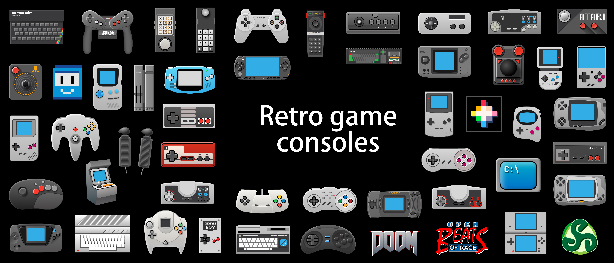
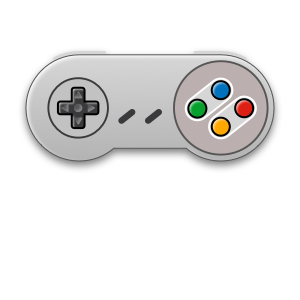
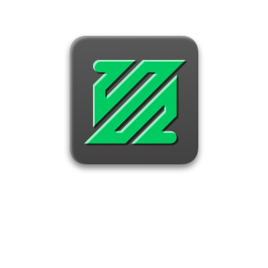
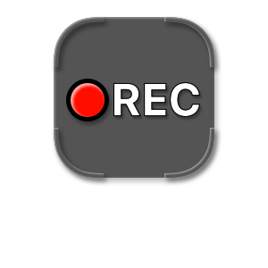

> [series_miyoo icons](./series_miyoo/README.md)

# Series TrimUI
# Retro game console icons, etc.
High resolution. Take whatever you need and create something great.

- Retro game console icons
- TrimUI app icons
- Art

They will look better on a black background, as I used a black background when drawing them.

## 1. Game console icons
   - 300w@1x 
   - 600w@2x 

| Icon                                                                | Icon                                                            | Icon                                                          | Icon                                                              | Icon                                                            |
|---------------------------------------------------------------------|-----------------------------------------------------------------|---------------------------------------------------------------|-------------------------------------------------------------------|-----------------------------------------------------------------|
|          |        |    |      |       | 
|     |      |  |      |    | 
|     |     |    |     |          | 
|       |    |   |       |       | 
|           |          |       |         |         | 
|             |         |     |             |    | 
|             |          |    |     |        | 
|               |          |  |             |          | 
|              |           |         |  |     | 
|            |         |       |   |     | 
|               |        |   |             |          | 
|             |          |      |          |          | 
|            |       |        |            |      | 
|           |    |       |           |          | 
|            |         |        |           |     | 
|            |           |        |       |  | 
|           |      |    |         |          | 
|           |          |     |            |       | 
|  |  |    |           |          | 
|         |       |         |        |        | 
|     |     |     |       |

## 2. TrimUI app icons

| Icon                                                           | Icon                                                               | Icon                                                                 | Icon                                                            | Icon                                                            |
|----------------------------------------------------------------|--------------------------------------------------------------------|----------------------------------------------------------------------|-----------------------------------------------------------------|-----------------------------------------------------------------|
|    |     |  |  |  | 
|  |      |            |       |    | 
|     |  |       |     |    | 
|   |       |            |  |
